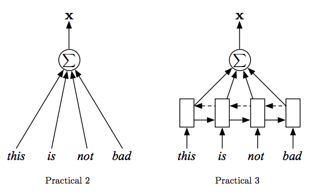
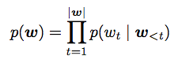
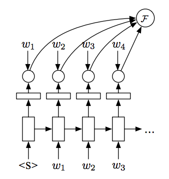
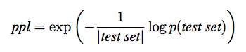

# Practical 3: Text Classification with RNNs
[Chris Dyer, Phil Blunsom, Yannis Assael, Brendan Shillingford, Yishu Miao]

In this practical, you can explore one of two applications of RNNs: text classification or language modelling (you are welcome to try both, too). We will be using the training/dev/test splits that we created in Practical 2.

## Text classification (Task 1)

Last week’s practical introduced text classification as a problem that could be solved with deep learning. The document representation function we used was very simple: an average over the word embeddings in the document. This week, you will use RNNs to compute the representations of the documents.

In the figure below, on the left we show the document representation function that was used in last week’s practical. Your goal in this task is to adapt your code to use the architecture on the right.

Note that in Practical 3, **x** is defined to be the average of the RNN hidden states (the **h_t**’s), just just the sum.

### Questions
1. What are the benefits and downsides of the RNN-based representation over the bag of words representation used last week? How would availability of data affect your answer?
2. One possible architectural variant is to use only the final hidden state of the RNN as the document representation (i.e., x) rather than the average of the hidden states over time. How does this work? What are the potential benefits and downsides to this representation?
3. Try different RNN architectures, e.g., simple Elman RNNs or GRUs or LSTMs. Which ones work best?
4. What happens if you use a bidirectional LSTM (i.e., the dashed arrows in the figure)?

**(Optional, for enthusiastic students)** RNNs are expensive use as “readers” on long sequences. Truncated backpropagation through time (truncated BPTT) can be used to get better parallelism. You are encouraged to use this to get better computational efficiency.

## Language Modelling with RNNs (Task 2)

As covered in lecture last week, RNN language models use the chain rule to decompose the probability of a sequence into the product of probabilities of words, conditional of previously generated words:

To avoid problems with floating point underflow, you it is customary to model this in log space.

Given a training sequence training graph for a language model looks like this:

Your task is to train an RNN language model on the training portion of the TED data, using the validation set to determine when to stop optimising the parameters of the model.

A language model can be evaluated quantitatively by computing the (per-word) perplexity of the model on a held-out test corpus,

where |*test set*| is the length of the test set in words, including any \<UNK\> tokens. (Note: you can measure length in terms of any units, including characters, words, or sentences, these are just ways of quantifying how much uncertainty the model has about different units.)

To evaluate the model qualitatively, generate random samples from the model by sampling from p(w\_t | **w**\_{\<t} ) and then feeding the sampled value of wt into the RNN at time t+1.

### Questions
1. If you change the preprocessing of your corpus (e.g., you turn more words in UNK or you lowercase everything), is perplexity still comparable?
1. To make training tractable you can either treat sentences as i.i.d. or you can use truncated BPTT. Is the i.i.d. assumption valid? What are the benefits and downsides of making this assumptions vs. truncated BPTT? How do you think perplexities will compare on the held-out test set? (If you’re feeling adventurous, try it out!)
1. Rather than modeling documents as a sequence of words, you can model the document as a sequence of characters. Are the per-word perplexities comparable between these two models? What benefits does modeling text at the character level have? What disadvantages?
1. Try a couple variations of the model using different definitions of RNNs (e.g., LSTMs, GRUs, simple Elman RNNs) that were covered in class. How do perplexities compare?
1. In text classification, using bidirectional RNNs was suggested, could you use bidirectional RNNs for the language modeling task? Why or why not?

#### Handin
On paper, show a practical demonstrator your response to these to get signed off.

